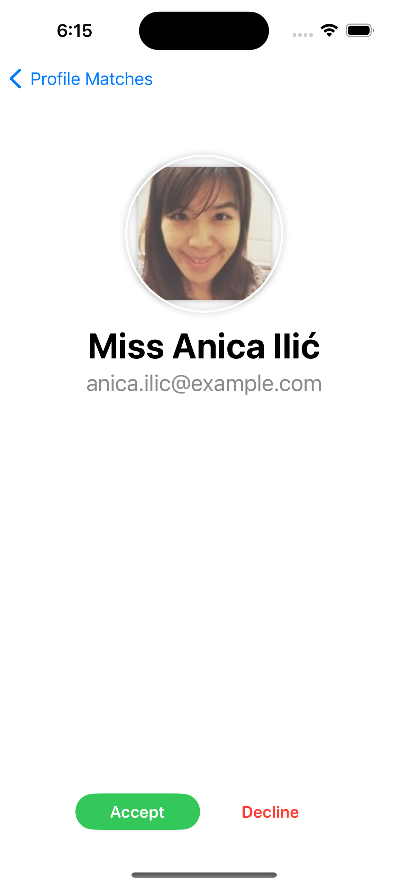

<h1>MatchMate App</h1>

<h2>Overview</h2>

MatchMate is a Swift-based iOS application that allows users to browse potential matches, accept or decline them, and view details of each match. The app supports both online and offline functionality, allowing users to accept/decline even without an internet connection

 
and on the basis of user action list is being sorted ( Accepted come on top and on the basis of Name)
<h2>Features</h2>
<ul>
  <li><b>Browse Matches:</b> View a list of potential matches fetched from the Api  </li>
  <li><b>Match Details:</b> Tap on any match to view detailed information.</li>
  <li><b>Accept/Decline Matches:</b> Users can accept or decline matches, with the option being stored locally and synced with the server once online,and on the basis of user action list is being sorted ( Accepted come on top and on the basis of Name).</li>
  <li><b>Offline Mode:</b> The app supports offline functionality, caching data locally and allowing users to accept/decline matches while offline.</li>
  <li><b>Image Caching:</b> Profile pictures are cached locally to enhance performance and reduce data usage.</li>
</ul>

 

<h2>Libraries Used</h2>
<ul>
  <li><b>SwiftUI:</b> For building the user interface.</li>
  <li><b>Combine:</b> For handling asynchronous events.</li>
  <li><b>Core Data:</b> For local data storage and caching.</li>
  <li><b>URLSession:</b> For making network requests to fetch data from the API.</li>
  <li><b>Network Monitor:</b> For monitoring the network connectivity status.</li>
  <li><b>Image Caching:</b> Custom image caching implementation to store and retrieve profile pictures efficiently.</li>
</ul>

 

<h2>Architecture</h2>

The app follows the MVVM (Model-View-ViewModel) architecture to maintain a clear separation of concerns, ensuring that the business logic is separated from the UI and data layers.

<ul>
  <li><b>Model:</b> Represents the data structure and manages the business logic.</li>
  <li><b>View:</b> Responsible for the layout and display of the UI.</li>
  <li><b>ViewModel:</b> Acts as a mediator between the Model and View, handling data binding and business logic execution.</li>
</ul>

<h2>Screenshots</h2>

Below are some screenshots of the MatchMate app:

  

